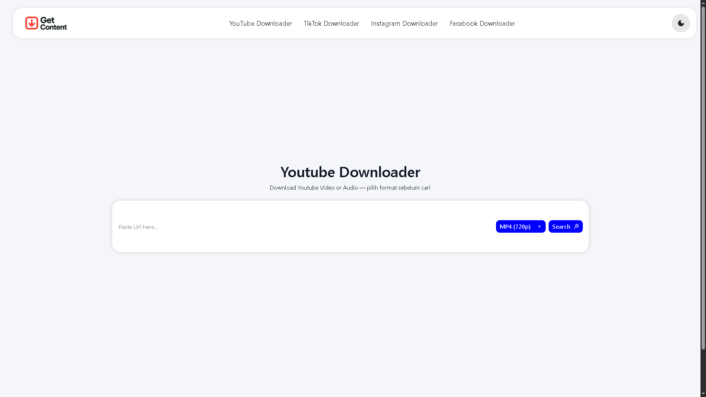

# Get-Content

## Description

A Simple web platform for download youtube, instagram, tiktok, and facebook content. Built with Node.js v22.18.0., Express.js, and Redis. Our main reference is [ddownr.com](https://ddownr.com/enM4/)

## Image




## Instalation

1. **Clone Repository**

    ```bash
    git clone https://github.com/Wz-00/youtube-downloader-node.git
    cd youtube-downloader-node
    ```
2. **Install Depedencies**

    ```bash
    npm install express morgan helmet cors express express-rate-limiter xss sequelize sequelize-cli dotenv ioredis mysql2 node-cron youtube-dl-exec ytdl-core fs-extra bull 
    npm install && npm run build
    ```
3. **Configure env**

    * Copy '.env.example' to '.env'
    * Configure and adjust your database, and redis link
    ```bash
    PORT=4000
    NODE_ENV=development

    REDIS_URL=redis://127.0.0.1:6379
    PUBLIC_BASE_URL=http://127.0.0.1:4000
    TEMP_DIR=./tmp
    JOB_RESULT_TTL=86400

    # database
    DB_DIALECT=mysql
    DB_HOST=127.0.0.1
    DB_PORT=3306
    DB_NAME=yt_downloader
    DB_USERNAME=root
    DB_PASSWORD=
    SEQUELIZE_LOGGING=false
    ```
4. **Migration**

    ```bash
    npx sequelize-cli db:migrate
    ```
5. **Run the Server**

    * On the first terminal, run this code
    ```bash
    npm run worker
    ```

    * On second terminal, run this code
    ```bash
    npm start
    ```

## Usage
* Access selected url and port to get api documentation, for example 'http://127.0.0.1:4000'
* Consume the api with your frontend framework or use available frontend for this project in 'https://github.com/Wz-00/get-content-vue'
* Run the frontend server

## Folder Structure
```
├── app/
│   ├── config/
|   ├── controllers/
│   ├── Models/
│   └── services/
├── cron/
├── database/
│   ├── migrations/
│   └── seeders/
├── public/downloads/
├── routes/
│   └── video.js
└── worker/
    └── mergeWorker.js
```

## Technologies

* **Language**: Javascript, Node.js
* **Framework**: Express.js
* **Database**: MySQL, Redis

## Contribute

We would appreciate the contribution! You can ask *pull request* or create new *issue* for new feature or fixing bug

## Contact

Develop by Wizz Sendpai. You can call me for question or collaboration in:
* Email: `wildanjk14@gmail.com`
* GitHub: [Wz-00](https://github.com/Wz-00)
